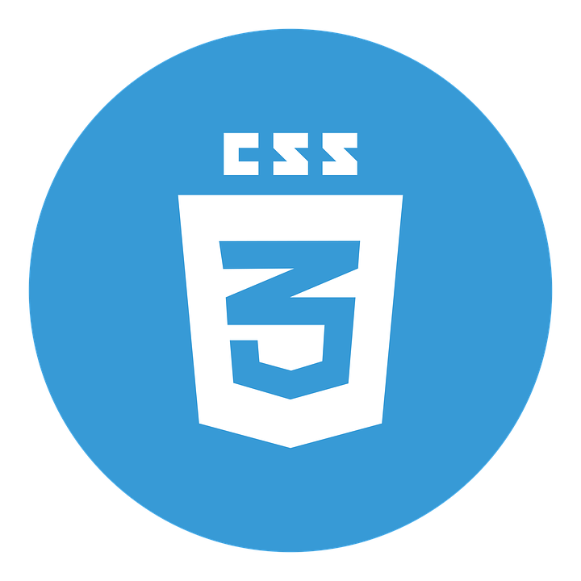

<h1 align="center">Hi 👋 I'm Makoto</h1>
  
  <h3 style="align-items: left;">Languages and Tools:</h3>
<!--   <h5 style="align-items: left;">Development Environment</h5>
  

    
  
 -->
  
  
  <h4 style="align-items: left;">Programming Languages</h4>
  

    
  
  

  

  <h4 style="align-items: left;">HyperText Markup Language</h4>
  

    
    
    

  

    <h3 style="align-items: left;">License:</h3>
    
<!--     <h3 style="align-items: left;">Language:</h3>  -->
                                                                                                                                     
<!--    <h3 style="align-items: left;">Statistics:</h3> 

 -->
